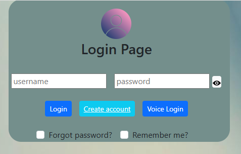
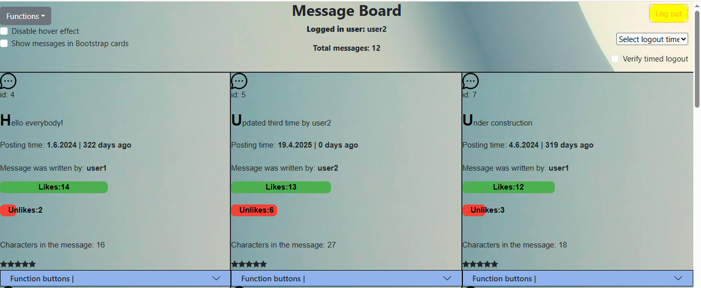
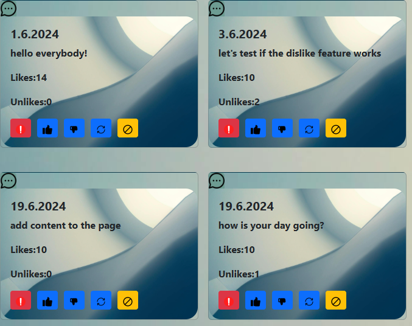
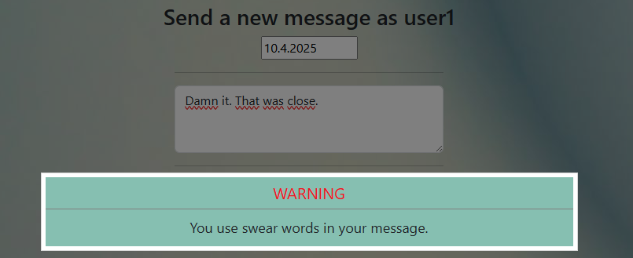
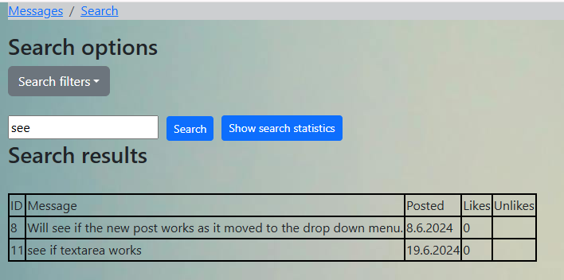
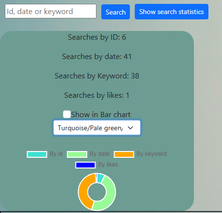
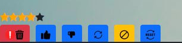

Project keywords: Axios, ReactJS NodeJS MySQL, CSS, HTML, Bootstrap 5, Profanity API

A React application with a Node.js backend and a MySQL database. The main purpose of this app is to emulate message board and discussion forums.

An example image of a login page that mimics the login view of commonly used web applications.  A user can log in by typing in the username and password fields or by using the voice login feature. Voice login listens to the user using the device's microphone and then populates the username and password fields with the values ​​it hears. The application uses the device's microphone for 20 seconds, after which it is closed. This feature is implemented using the JavaScript SpeechRecognition API.

The Remember Me feature stores the username and password in LocalStorage. The login page uses a onload event in the body element, which is executed by a function that checks LocalStorage and places the username and password found there into the input fields.

Example image of a page showing all messages stored in a MySQL database. each message has its own buttons with which you can e.g. like, edit, censor a post, etc. Posts also have a CSS Flex style definition where each post has its own post area that is 33% wide. At the end of each post is a row of Bootstrap 5 style buttons that allow the user to like or dislike the post, edit the post, censor the post text, and reset the censored text. Most of the buttons use Bootstrap's primary button style, but the delete button uses Bootstrap 5's danger button style, and the censorship button uses BS5's warning style. This is done for a good user experience

MAIN FEATURES

PROTECTED ROUTES

The routes are secured with the React router V6. On the login page, the authentication token is stored in LocalStorage if the username and password are correct.then the private routes component uses the localstorage get item method to get a "true" value that authenticates access to other pages. The default value of the private route component is "False", which prevents access to routes without a successful login.

VIEW CUSTOMIZATION

User can change message view from default view to Bootstrap 5 card style. By clicking the checkbox, each message in the database will appear on own BS5 card. Example image where the user has switch the view to BS5 card style.

SWEARWORD FILTER

The app uses API Ninja's Profanity Filter API to detect profanity. After the user has typed text into the textarea filter and removed focus, the textarea onBlur event handler executes an action that sends the user's text to the API. If the API detects foul language, the user will see a Modal that tells them that the message contains profanity. The modal is created using the reactjs-popup library. In the example image, the Filter API recognizes the word "Damn it" in the sentence.

SQL SEARCHES

You can search the database using the html interface. search options: Search by ID number, Search by message sending date, search by most liked and least liked posts and SQL %Like% query where you can
search with your own keyword. You can select the option to use by clicking on the html checkbox. The check boxes are below the drop-down menu.

The search component is the so-called unmanaged component so I use the useRef method to get the user input.
The search result view is editable, you can hide unnecessary information using check boxes. By clicking on them, the state variable changes the hidden value of the html elements between true/false

You can also choose whether you want to see the results of the sql query in a div element or a table element by clicking the checkbox.

Example image where the user has searched for messages with the keyword "under".

ERROR HANDLING IN SQL QUERY AND INCORRECT USERNAME OR PASSWORD CASE

If no results are found with the search criteria or the credentials are incorrect, a separate error component is displayed to notify the user of the error. With the UseLocation method, the error component always gets the right status variable, which tells whether the error was a failed login or a failed sql query.

SQL SEARCH STATISTICS & CHARTJS

All searches are saved in the search table. you can see the search statistics separated by search criteria in text and graphic form. The graphics are made with the ChartJS library. You can switch the displayed chart between a bar chart and a donut chart using a checkbox.

The colors of the charjs bar can be changed with the options in the drop-down menu. each option has 3 different colors and after selection, the program changes the color of all three bars to the colors of the selected option. For example, the option Red/Green/Blue changes the first bar to red, the second to green, and the third to blue.

Example image where the user has chosen to display the results in a ChartJS donut with a color combination of turquoise/light green/orange and blue.

LIKE / UNLIKE THE POST

Each saved post has likes and dislikes columns in the database, which can be added by clicking the thumbs up or thumbs down button. (SQL query: UPDATE messages SET `likes`= likes +1 WHERE id= ? )
the program searches for the id value of the corresponding post with the function parameter and updates the correct post based on it.

Login & CRUD features

Before you can use crud functions, you need to login. Username and password are stored in the sql database used by the program. If the login is successful, the program uses the react-router-navigate method to move the user to the home page. Input fields on the login page detects whether CapsLock is on and displays a notification. Detection feature is done using the onKeyUp property and the KeyboardEvent.getModifierState() method.

The login page has a remember me checkbox. clicking it saves the username and password to local storage.
every time the login page is loaded, the program checks the local storage (onload property in the main div) and if credentials are found, they are placed in the login fields.

Notice the update method: each message can be updated by clicking the update icon. when the user clicks the icon, the browser goes to, for example, this address http://localhost:3000/update/4, where the number is, is the message ID. The program uses the useParam hook to get the ID of the post.
Then the useEffect hook executes an function that contains an Axios get call with the ID that came from the browser parameters and stored by useParam.

LOG OUT

the logout feature uses the localstorage.clear() method to remove the token from local storage and navigates the user back to the login pages using the React useNavigation hook.

TIMED LOGOUT

Select a time from the drop-down menu and confirm your selection by clicking the checkbox. when the time runs out, the program returns to the login page with help of JS settimeout function.

CREATE ACCOUNT

If you don't have a username and password, you can create them. On the account creation page, the password is asked twice as in the real-life examples and stored in state variables. then the useEffect Hook checks if the passwords match. if the passwords are the same, the user will see a notification and the values ​​will be saved in the database. The Register button is disabled by default, but will be enabled if the password matches and The input fields are filled. The program also displays a green success icon if the requirements are met. The icon is stored in a state variable and displayed in the img element.

When you create an account, you can also use the option to create a password.
there are two checkboxes for random password: password with 8 letters and password with 10 letters. by choosing one of the two options, the function call is implemented with the onChange method, where the function receives either 8 or 10 as a parameter, which is the length of the password.
Random password including uppercase and lowercase letters and numbers.

PASSWORD CHANGE

a logged in user can use the My profile page. The path of my profile is /profile/{username} and the application gets the username from the local storage where it is saved at login. This way, changing the password is faster, because the username is already ready. the page cannot be accessed without a saved username

when changing the password, the program uses a "real life example" to evaluate the strength of the password. if the new password is less than 5 letters, the user sees a message in red text that the password is weak, if there are 5-8 letters, the text is yellow and if the password is longer than 8 letters, the text is green. this is done with two onChange events, the first event updates the state variable and the second is a function that does the evaluation. The password evaluator can also search for special characters. this is made with JS Array some method.

CENSORSHIP OF THE TEXT

The user can hide the text of any message by clicking the censor button. The class name of the text part of each message is m and the ID number of the message, and the function performing the censorship receives the ID number of the clicked message as a parameter. Then with the js setAttribute method, the class name is changed to a censored class that hides the text of the selected message. State variable controls text censorship. is state is true, text will hide and replaced with censored word. if state is false, text show, and censored word disappear.

STAR RATING Of MESSAGES

The star rating system uses the Font awesome star icon and works on the same principle as the text censorship feature. The function receives the id of the selected message as a parameter, then the star class of the selected message is changed using the setAttribute method fa from the fa-star class to the fa-star-checked class, where the star color is defined as yellow. The class name of each star contains an id number, which allows the program to update the stars of the correct messages. You can give any post 1-5 stars by clicking on the star. the color of the star changes from black to yellow one by one.

Example image where a user has given a single post 4 stars/5

STAR RESET

Star reset works in the same way as star rating, but changes the star rating to fa fa-star using the setAttribute method.

CSS

With the help of the CSS-flex feature, 3 messages are always displayed in one line. After three messages, a new line starts for other messages. The CSS hover selector is used with paragraph tags to change the background color. If the user does not like the hover effect, it can be turned off by clicking the checkbox. Then the state variable changes to a different div class that doesn't have a hover selector.

In the message view, text align is editable. You can align the message text to the center or to the
left by clicking the checkbox.

Bootstrap 5

The application's html buttons are made with Bootstrap 5 button components. The Message and Search components also has a Bootstrap 5 drop-down menu where you can find links to new post page and search page.

Database data can also be displayed in the Bootstrap card container. Click on the check box and a new component will be called which organizes the fetched data into Bootstarp cards, always showing 3 cards in one line. Pressing the checkbox again changes the view back to the home view, which means that the database information is displayed in the div element

For navigating between pages, there is a Bootstrap breadcrumb component with react-router-dom link API.

ICONS

The program uses some icons, mainly in buttons. Icons are downloaded from www.flaticon.com. All are 16 pixels in size.

